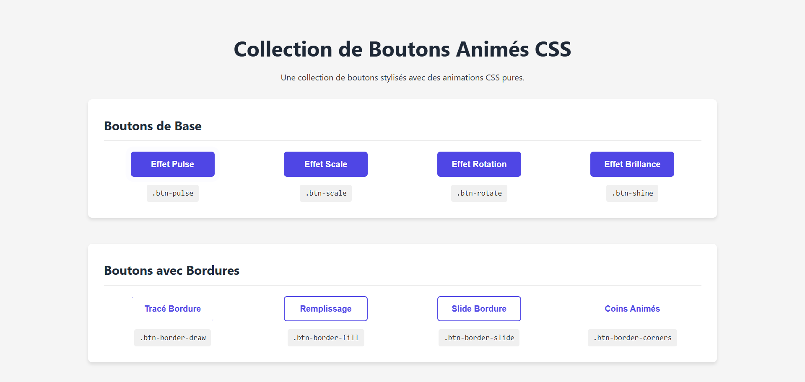

# Collection de Boutons Animés CSS

Une bibliothèque de boutons stylisés avec des animations CSS pures, faciles à intégrer dans n'importe quel projet web sans dépendances externes.

## Aperçu du projet



La collection comprend 20 boutons dans 5 catégories différentes :
- Boutons de base
- Boutons avec bordures
- Boutons avec icônes
- Boutons avec effets 3D
- Boutons avec effets de texte

## Comment utiliser cette collection

### Option 1: Intégration directe des fichiers

1. Téléchargez les fichiers `styles.css` du projet
2. Liez le fichier CSS dans votre HTML:
```html
<link rel="stylesheet" href="chemin/vers/styles.css">
```
3. Ajoutez les classes aux boutons dans votre HTML:
```html
<button class="btn-pulse">Effet Pulse</button>
```

### Option 2: Copier uniquement les styles dont vous avez besoin

Chaque style de bouton est indépendant. Vous pouvez simplement copier le CSS spécifique du bouton que vous souhaitez utiliser.

## Catalogue des boutons

### Boutons de Base

| Classe | Description |
|--------|-------------|
| `.btn-pulse` | Effet de pulsation continue |
| `.btn-scale` | Agrandissement au survol |
| `.btn-rotate` | Légère rotation au survol |
| `.btn-shine` | Effet de brillance au survol |

### Boutons avec Bordures

| Classe | Description |
|--------|-------------|
| `.btn-border-draw` | Animation de dessin de bordure |
| `.btn-border-fill` | Remplissage de la bordure au survol |
| `.btn-border-slide` | Effet de slide depuis le bas |
| `.btn-border-corners` | Animation des coins |

### Boutons avec Icônes

| Classe | Description |
|--------|-------------|
| `.btn-icon-rotate` | Rotation de l'icône |
| `.btn-icon-slide` | Apparition de l'icône en sliding |
| `.btn-icon-expand` | Agrandissement de l'icône |
| `.btn-icon-pop` | Apparition de l'icône en pop |

### Boutons avec Effets 3D

| Classe | Description |
|--------|-------------|
| `.btn-3d-push` | Effet d'enfoncement 3D |
| `.btn-3d-lift` | Élévation avec ombre portée |
| `.btn-3d-float` | Animation de flottement continue |
| `.btn-3d-flip` | Effet de retournement complet |

### Boutons avec Effets de Texte

| Classe | Description |
|--------|-------------|
| `.btn-text-swap` | Changement de texte au survol |
| `.btn-text-glitch` | Effet de glitch sur le texte |
| `.btn-text-slide` | Slide du texte |
| `.btn-text-circle` | Transformation en cercle |

## Personnalisation

Vous pouvez facilement personnaliser les couleurs en modifiant les variables CSS au début du fichier:

```css
:root {
    --primary: #4F46E5;
    --primary-dark: #4338CA;
    --primary-light: #818CF8;
    --secondary: #EC4899;
    --secondary-dark: #DB2777;
    --secondary-light: #F472B6;
    --success: #10B981;
    --warning: #F59E0B;
    --danger: #EF4444;
    --dark: #1F2937;
    --light: #F9FAFB;
}
```

## Compatibilité

Cette collection est compatible avec tous les navigateurs modernes:
- Chrome 60+
- Firefox 55+
- Safari 11+
- Edge 16+

## Optimisation mobile

Tous les boutons sont responsifs et s'adaptent aux écrans mobiles.

---

## 👨‍💻 Auteur
Créé par [Eryaz](https://github.com/eryaz2025)